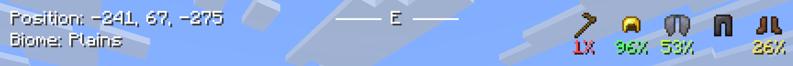

# Sp0k's HUD+

**Sp0k's HUD+** is a lightweight client-side Fabric mod that adds useful player information to the Minecraft HUD without opening the debug screen.

It is designed to keep important gameplay information visible in a clean, minimal, and configurable way.



## Features

- Displays the player's current block position
- Displays the biome the player is standing in
- Formats biome names into readable text
  - Example: `old_growth_birch_forest` -> `Old Growth Birch Forest`
- Shows the player's cardinal direction at the top-center of the screen
- Optional direction guide lines beside the cardinal direction
- Displays equipped armor icons on the top-right of the screen
- Displays the currently held damageable tool alongside equipment
- Shows armor and tool durability
- Supports durability display modes:
  - Percentage
  - Remaining hits
- Uses color-coded durability text:
  - Green for high durability
  - Yellow for medium durability
  - Orange/red for low durability
- Supports HUD UI scaling:
  - Small
  - Medium
  - Large
- Medium is the default size and keeps the original HUD scale
- Allows HUD offset customization with `hudX` and `hudY`
- Hides the custom HUD when the vanilla F3 debug screen is open
- Moves the equipment HUD down when active status effects are visible to avoid overlap
- Indicator when the player is in a slime chunk

## Configuration

Sp0k's HUD+ includes an in-game configuration screen when **Mod Menu** is installed.

The configuration screen is organized into submenus:

### Main Options

- UI Size: Small, Medium, or Large
- HUD X position slider
- HUD Y position slider
- Location Information submenu
- Direction submenu
- Equipment HUD submenu
- Toggle showing the HUD while F3 is open

### Location Information

- Toggle the full location information display
- Toggle position display
- Toggle biome display
- Toggle slime chunk indicator

### Direction

- Toggle the full direction display
- Toggle direction guide lines

### Equipment HUD

- Toggle the full equipment display
- Toggle armor display
- Toggle tools display
- Switch durability display between percentage and remaining hits

The config file is generated automatically at:

```text
.minecraft/config/spokhud.json
```

## Requirements

- Minecraft `26.2`
- Fabric Loader
- Fabric API
- Java `25`

## Optional Dependencies

- Mod Menu
  - Required only for the in-game configuration screen
  - The HUD itself works without Mod Menu

## Installation

1. Install Fabric Loader for Minecraft `26.2`.
2. Install the matching Fabric API version.
3. Optional: install Mod Menu if you want to configure the HUD in-game.
4. Download the latest `.jar` release of **Sp0k's HUD+**.
5. Place the `.jar` file in your Minecraft `mods` folder.
6. Launch Minecraft with the Fabric profile.

## Development Setup

Clone the repository:

```bash
git clone https://github.com/Sp0k/Sp0kHud.git
cd Sp0kHud
```

Build the mod:

```bash
./gradlew clean build
```

The built mod JAR will be generated in:

```text
build/libs/
```

Use the normal release JAR, not the `-sources` JAR.

## License

Distributed under the CC0-1.0 license. See [LICENSE](LICENSE) for more information.
